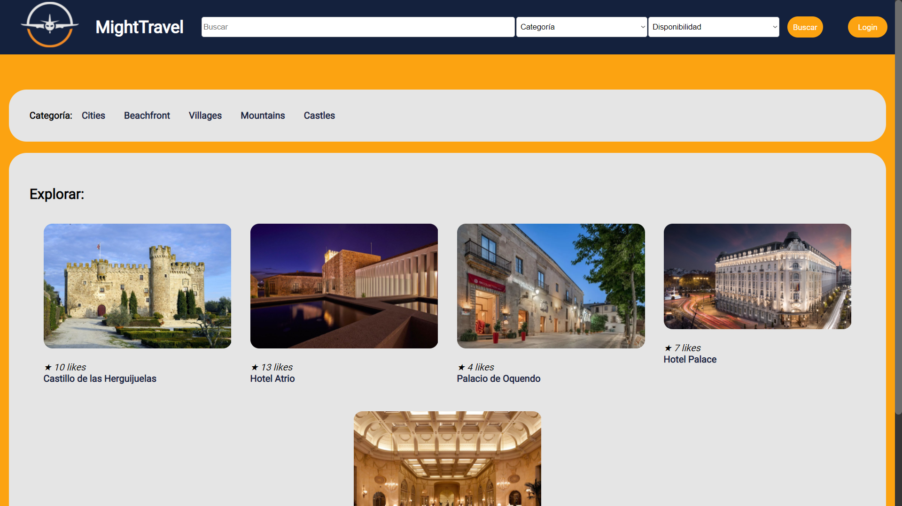
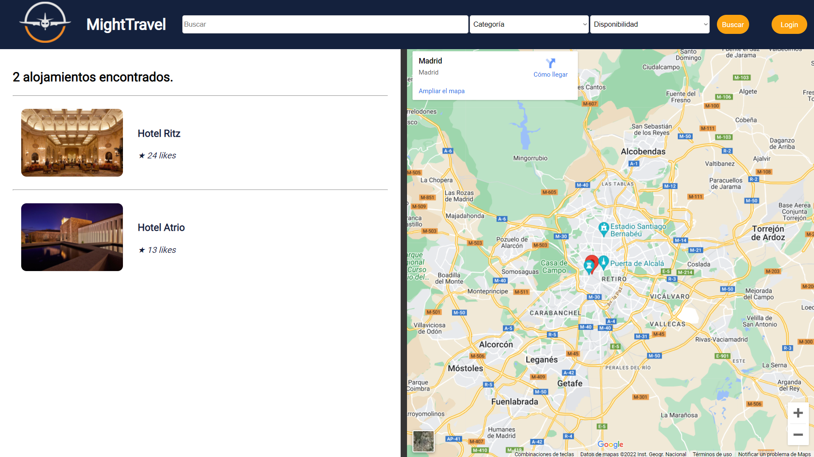
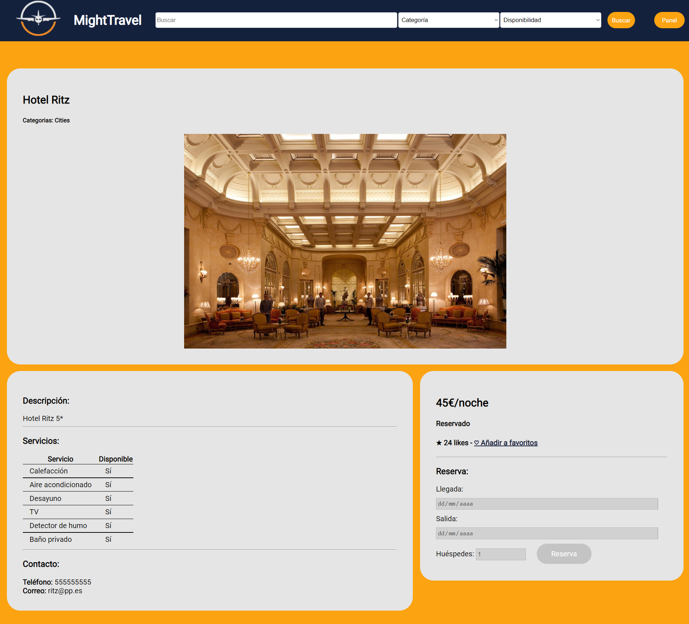
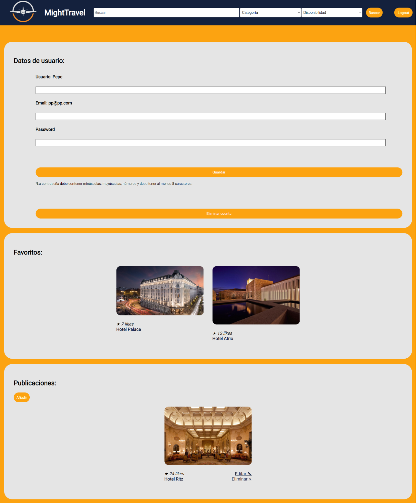
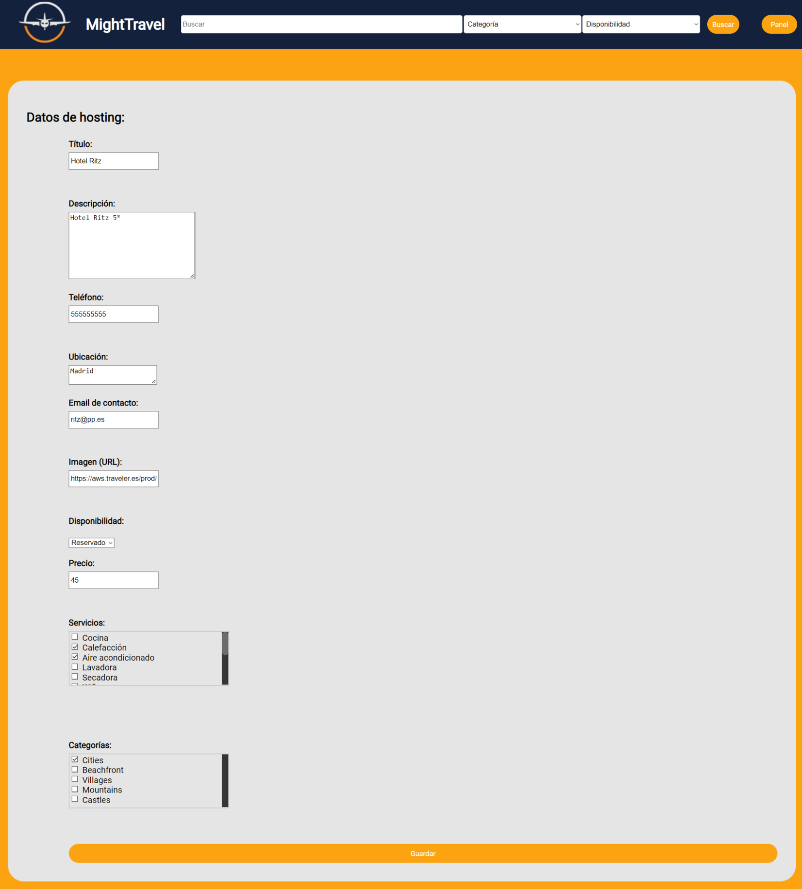

# 🧭 MightTravel

[English version](README.md) | [Versión en español](README.es.md)

  <picture>
    <source media="(prefers-color-scheme: dark)" srcset="res/img/project_logo_white.png">
    <source media="(prefers-color-scheme: light)" srcset="res/img/project_logo_black.png">
    
  </picture>

 

**MightTravel** es una aplicación web de reservas de alojamientos online creada como proyecto dentro de la asignatura **Programación en Internet**.  

Su propósito es ofrecer una experiencia intuitiva y visualmente agradable para explorar, reservar y gestionar alojamientos turísticos desde un único portal.

---

## 🌍 Vista general

La plataforma da la bienvenida con un listado de alojamientos disponibles, donde los usuarios pueden buscar por nombre, categoría o disponibilidad.  

---

## 🔍 Exploración y búsqueda

El sistema de búsqueda permite combinar filtros para localizar alojamientos específicos o descubrir nuevas opciones. Los resultados se muestran de forma clara, con acceso directo a los detalles de cada alojamiento.   

También se muestra un mapa que muestra la ciudad en la que se encuentra el primer alojamiento obtenido.

Los usuarios pueden acceder a la página de detalles de un alojamiento para consultar información más completa, como su disponibilidad, ubicación y opciones de reserva.

---

## 👍 Interacción del usuario

Los usuarios registrados pueden guardar sus alojamientos favoritos, visualizar su lista personalizada y gestionar sus publicaciones desde el panel de usuario.

La página de login y registro cuenta con un diseño elegante y minimalista que facilita el acceso y la creación de cuentas de usuario.

---

## 🏠 Publicaciones y gestión

Cada usuario dispone de un espacio para crear, editar o eliminar sus propios alojamientos, incluyendo la posibilidad de asignar imágenes, categorías y estado de disponibilidad.  
El proceso es simple y está pensado para ofrecer un flujo de publicación rápido e intuitivo.

---

## 💾 Base de datos

El repositorio incluye una base de datos SQLite de ejemplo (`data/mighttravel.db`) con **datos de demostración** que permiten probar el funcionamiento de la aplicación sin necesidad de rellenarla manualmente colocándola en `%USERPROFILE%/sqlite_dbs/mighttravel.db`.  
   
> ⚠️ No contiene información sensible ni datos reales, únicamente ejemplos creados para fines demostrativos.

---

## 👨‍💻 Autor

**Francisco Javier Ortiz Valverde**  
*Proyecto académico - Programación en Internet (Curso 2021/2022)*  
🏫 Universidad de Extremadura (UEx)