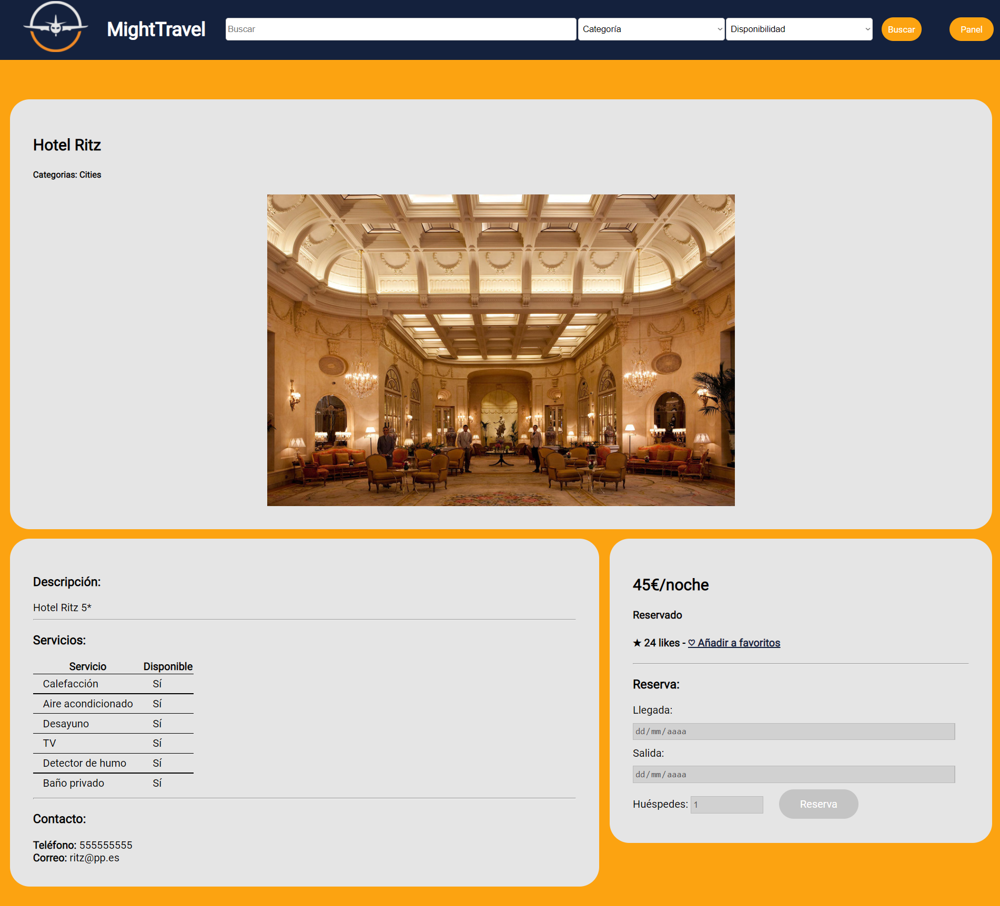
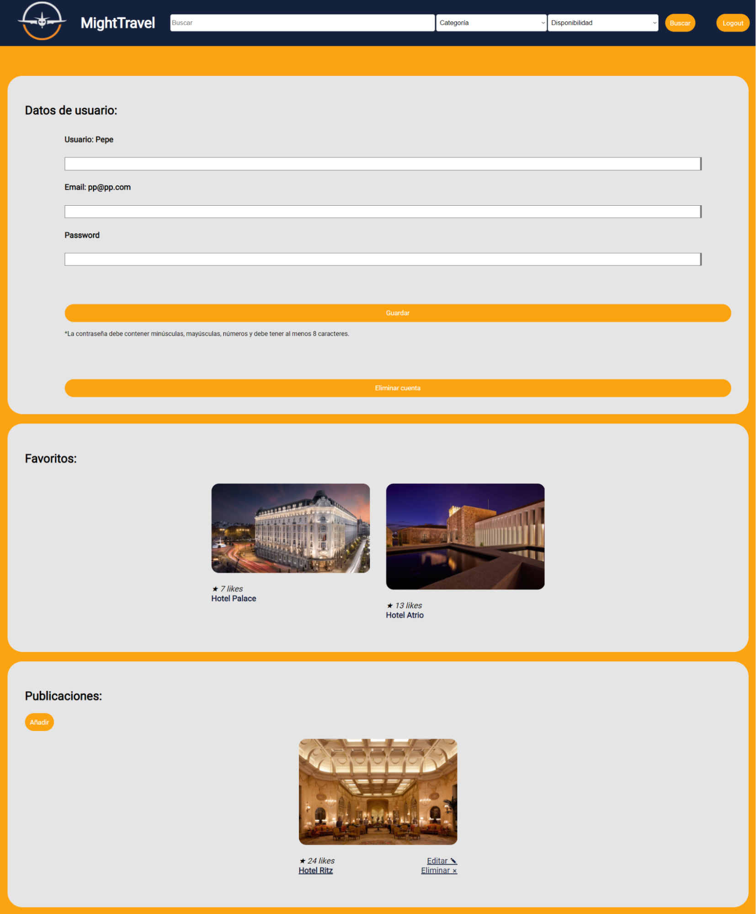
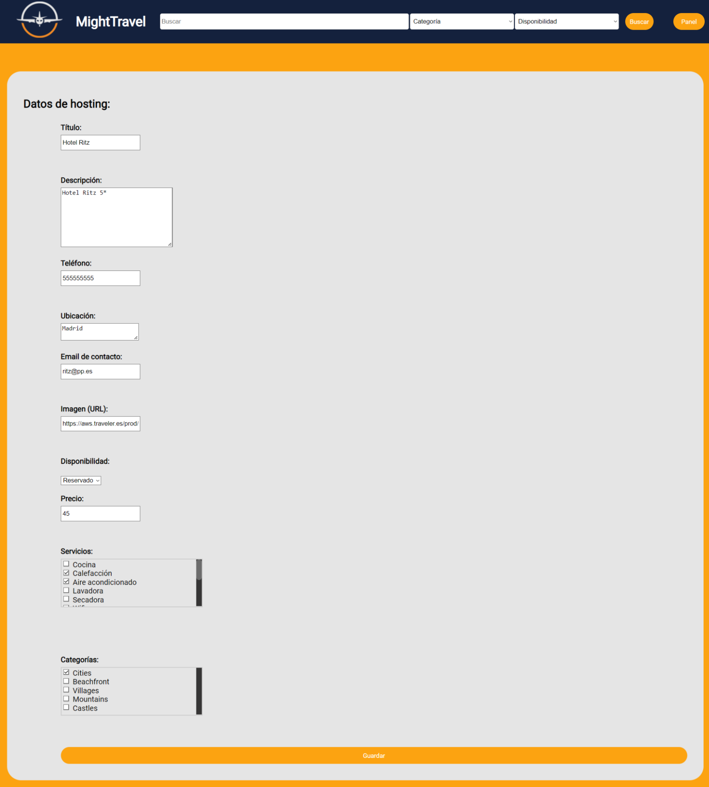

# 🧭 MightTravel

[English version](README.md) | [Versión en español](README.es.md)

  <picture>
    <source media="(prefers-color-scheme: dark)" srcset="res/img/project_logo_white.png">
    <source media="(prefers-color-scheme: light)" srcset="res/img/project_logo_black.png">
    
  </picture>

 

**MightTravel** is a web application for online accommodation booking, developed as a project for the **Internet Programming** course.   

Its purpose is to provide an intuitive and visually appealing experience to explore, book, and manage holiday rentals in one place.

---

## 🌍 Overview

The platform welcomes users with a list of available accommodations, allowing them to search by name, category, or availability.

---

## 🔍 Search and exploration

The search system allows users to combine filters to find specific accommodations or discover new ones. Results are displayed clearly, with direct access to detailed information for each listing.  

It also includes a map view showing the city of the first result retrieved.

Users can open an accommodation’s detail page to view more information, including availability, location, and booking options.

---

## 👍 User interaction

Registered users can save their favorite accommodations, view their personalized list, and manage their own posts from the user panel.

The login and registration page features a clean and elegant design, offering an easy way for users to access their accounts.

---

## 🏠 Posting and management

Each user has a personal area to create, edit, or delete their own listings, with the option to assign images, categories, and availability status. The process is designed to be fast and intuitive, ensuring a smooth publication flow.

---

## 💾 Database

The repository includes a sample SQLite database (`data/mighttravel.db`) containing **demo data** to showcase the system’s functionality.  

This allows the project to be run and explored immediately, without needing to populate the database manually by placing it in `%USERPROFILE%/sqlite_dbs/mighttravel.db`.  
  
> ⚠️ No sensitive or real user information is stored, the data is purely for demonstration purposes.

---

## 👨‍💻 Author

**Francisco Javier Ortiz Valverde**  
*Academic Project - Internet Programming (2021/2022)*  
🏫 University of Extremadura (UEx)
